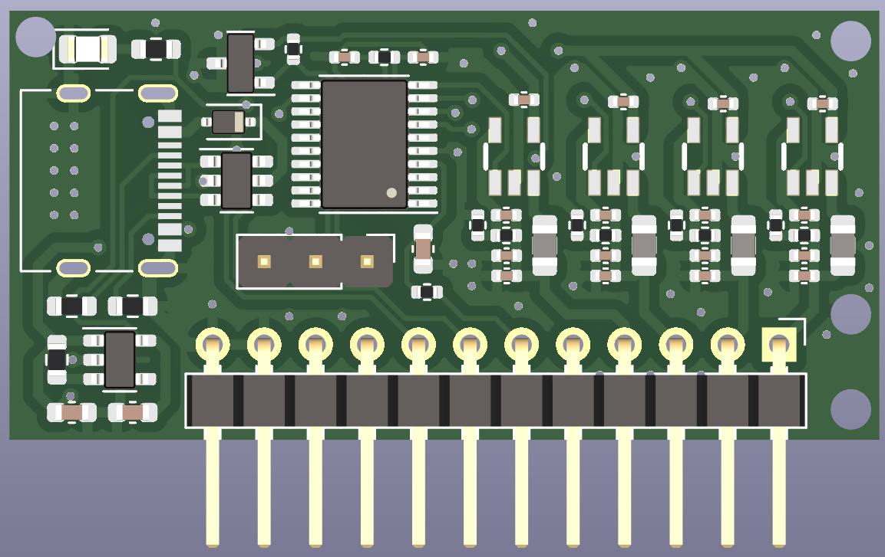
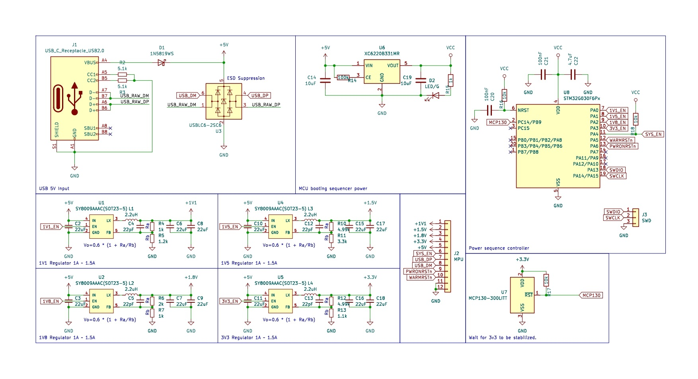

# AM33xx SBC project.
This project is to create a SBC (Single board computer).
However, despite its name, it is divided into several boards.

## Power-supply board.
  This take power from Type-C USB, and regulates it to 3.3v, 1.8v, 1.5v and 1.1v LDO.
and `STM32G030F6P6` controls power sequence of each voltage lines. And, unfortunately, 
current implementation has no `On/Off` button. when the power cable attached, 
this just turn the board on.

### Rendering:


### Schematic:


### Pinmap.
Pins of the mini power-supply board has following pin map (2.54mm pitch):

```
Right to left order.
1. 1v1
2. 1v5
3. 1v8
4. 3v3
5. 5v
6. SYS_EN
7. USB_DP
8. USB_DM
9. PWRONRSTn
10. WARMRSTn
11. GND
12. GND
```
